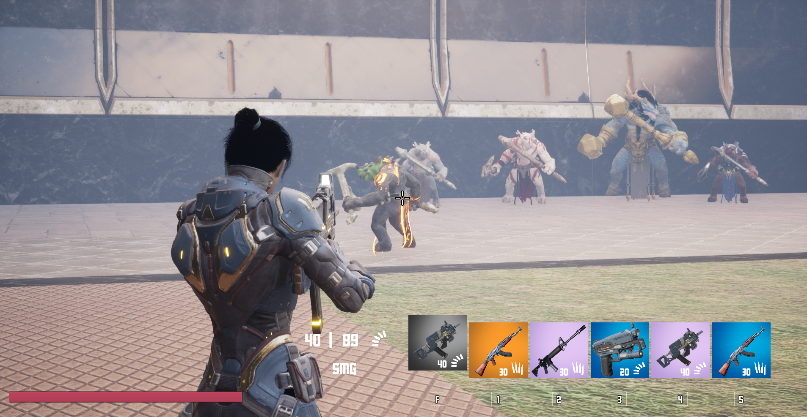
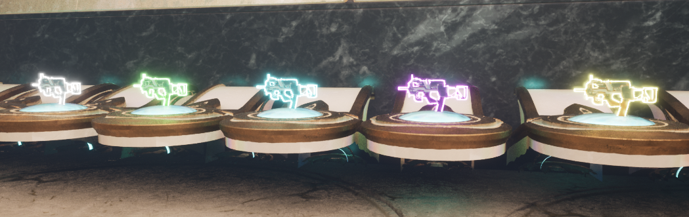
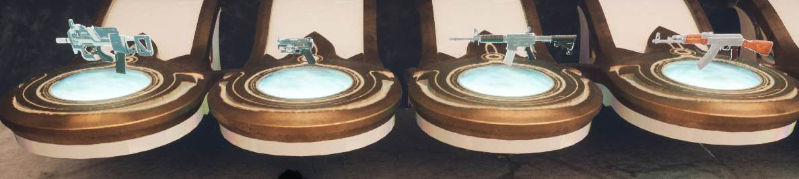
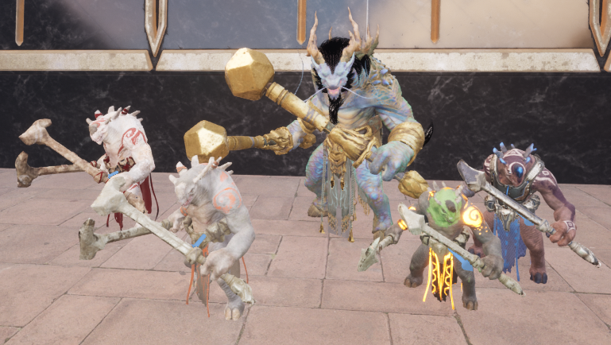
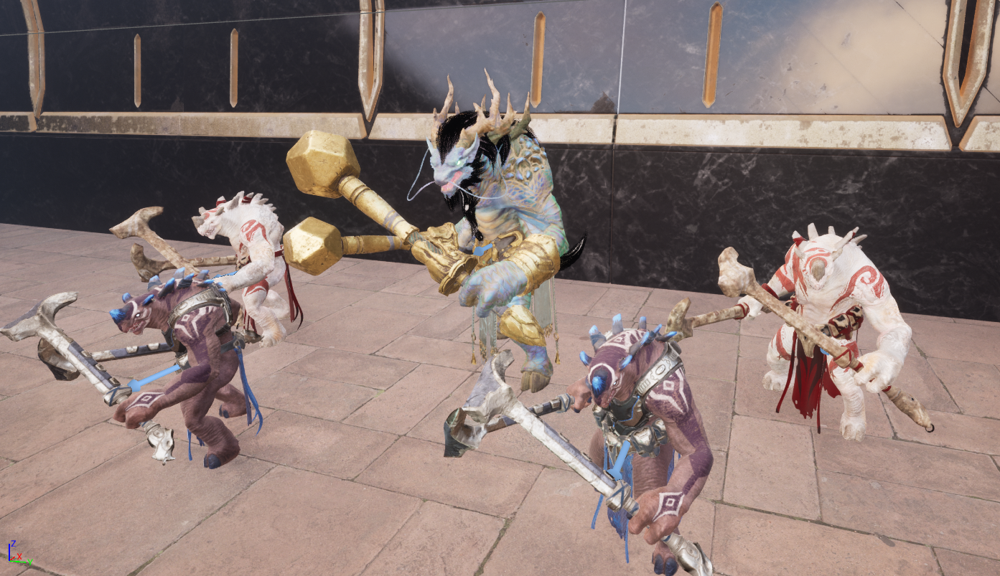

# Freedom-Arena
## Unreal Engine 5.1 C++ Project
Freedom Arena is the third person shooter game.

It is not completed yet.
### Story
Story is based on the character who tries to earn his freedom again with figthing in the arena. The character has to win champhionship to achieve this.

### Features
Currently, there are 
- Shooter character and its animations,
- Different type weapons(Pistol, SMG, Assault Rifle, Semi Auto Rifle) and every weapons has different rarity(Common, Uncommon, Rare, Mythical, Legendary),

- Ammo(Heavy, Light),
- Inventory System,
- Explosive Barrel
- Different Footstep Based on Floor
- Highlight items
- Item Widgets
- HUD
- Currently there are different types of Grux(enemy) which can chase, patrol and attack.

### Currently Working on 
- Different Enemies
  
### TODO
- Level Designs
- UI

